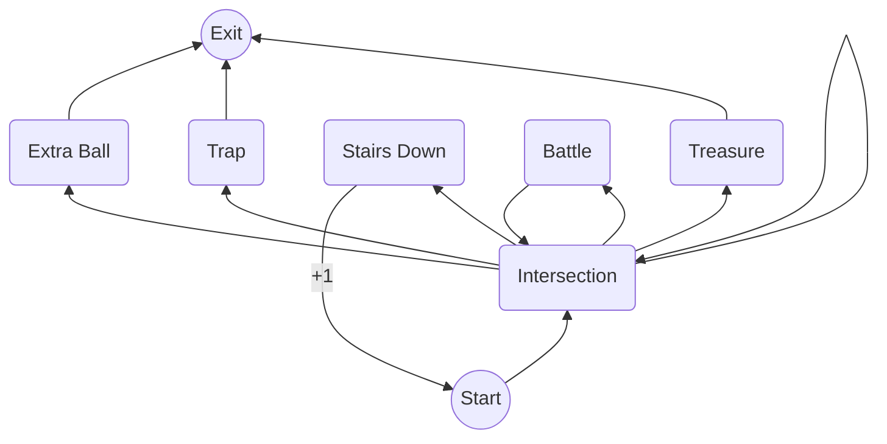

# Dungeon Crawl Mapper - Design Notes

## Node Types

* INTERSECTION: go left, straight, or right
* BATTLE: battle an enemy, then continue to another room
* TRAP: exit the dungeon
* TREASURE: collect the treasure and exit the dungeon
* EXTRA BALL: light the extra ball insert and exit the dungeon
* STAIRS DOWN: go to the next dungeon level

## Possible Node Transitions

